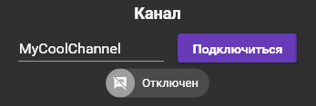
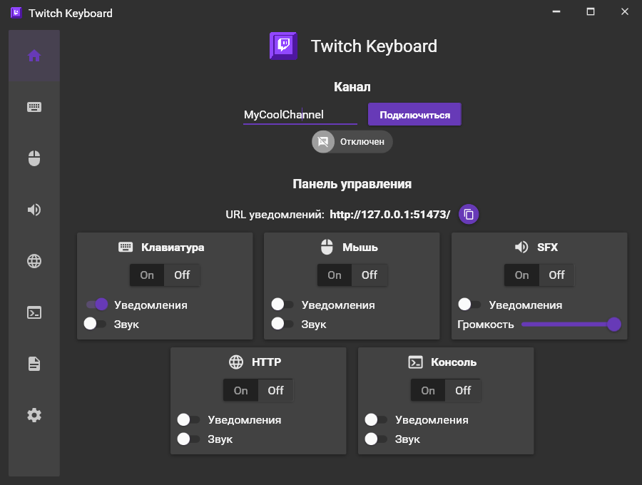
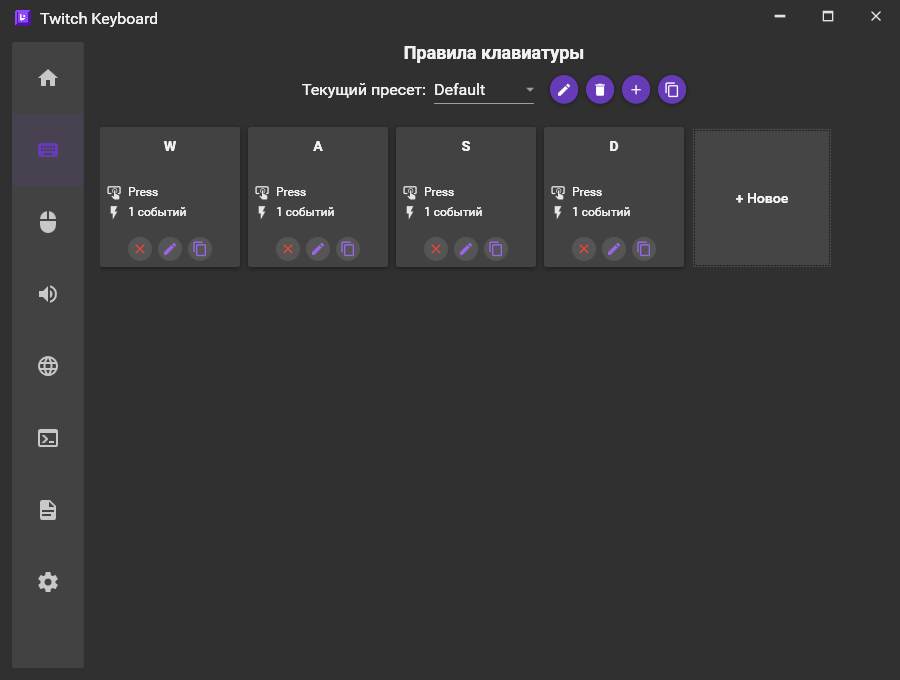
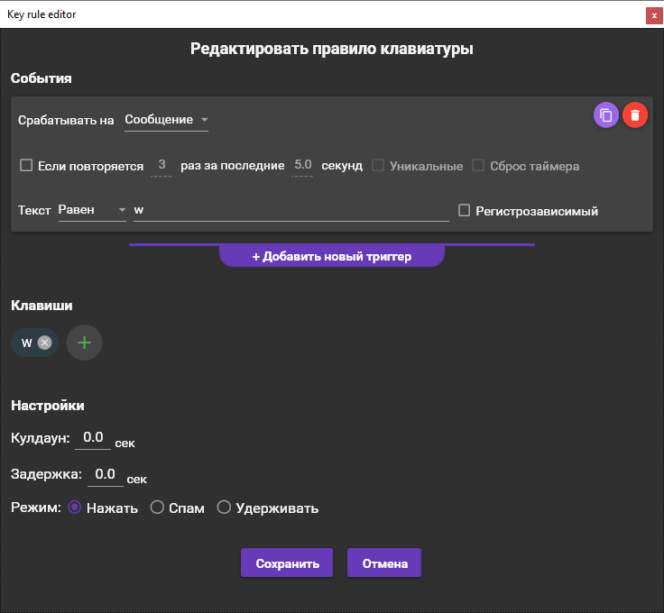
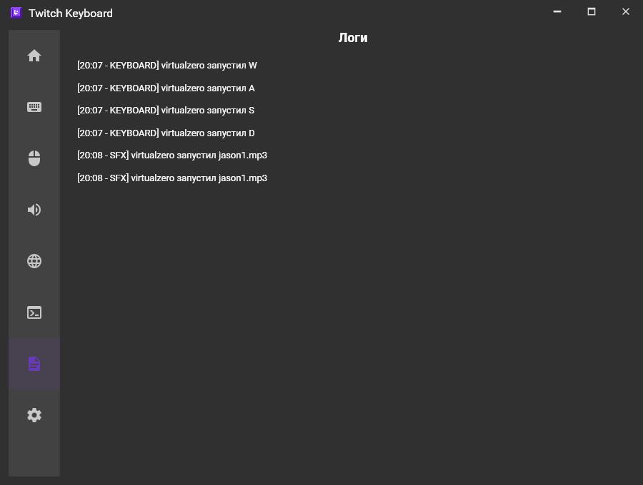
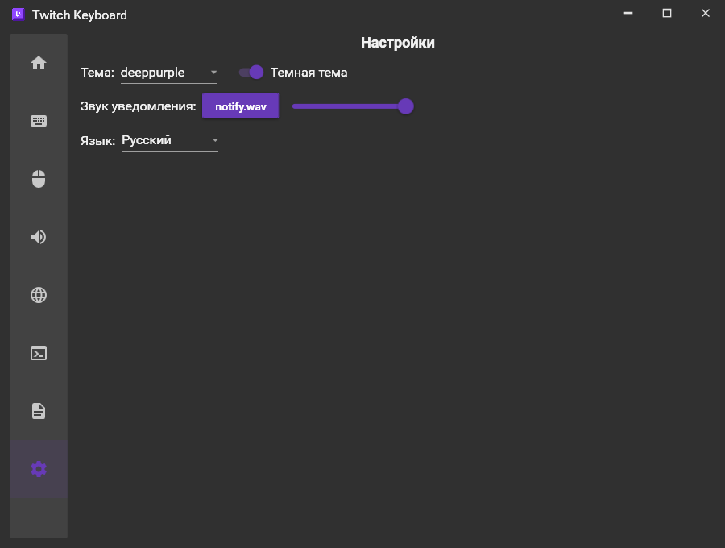

# Twitch Keyobard

  

### 

|  [English version](https://github.com/VirtualZer0/TwitchKeyboard/blob/master/README.md) |  Русская версия |
| -----------------------------------------------------------: | -------------------------------------------- |

## 👁‍🗨 О приложении

**Twitch Keyboard** - open-source приложение для Windows, которое позволяет вам запускать определенные сценарии при выбранных вами событиях в чате на Twitch.

**Список поддерживаемых сценариев:**

- Управление клавиатурой
- Управление мышью
- Запуск звуковых эффектов
- Запуск HTTP-запросов
- Запуск консольных команд или запуск выбранных файлов

**Список поддерживаемых событий:**

- Сообщения в чате

- Использование наград

- Использование Bits

- Новая подписка

- Переподписка

- Подарочная подписка

- Рейд

  

**Возможные варианты применения:**

- Управление вашей игрой зрителями из чата
- Переключение сцен в OBS при помощи горячих клавиш
- Запуск звуковых эффектов при многократном повторе ключевых слов в чате
- Запуск произвольных скриптов для ваших устройств с помощью HTTP или командной строки

## 🕐 Быстрый старт

1. Скачайте и установите .NET 5 **Desktop Runtime** по [**этой ссылке**](https://dotnet.microsoft.com/download/dotnet/5.0). На последних версиях Windows фреймворк может быть установлен по умолчанию.

2. [**Скачайте последнюю версию приложения**](https://github.com/VirtualZer0/TwitchKeyboard/releases)

3. Распакуйте папку в удобное вам место и запустите <u>TwitchKeyboard.exe</u>

4. Введите имя канала и нажмите на кнопку "Подключиться". Это необходимо сделать в первую очередь, если вы хотите получить список ваших наград за баллы канала:

   

5. [Опционально] Добавьте BrowserSource с уведомлениями приложения на вашу сцену в OBS. URL для уведомлений находится на главном окне программы:

    

## 💬 Подробные инструкции

❗ **Приведенные здесь скриншоты могут отличаться в зависмости от текущей версии Twitch Keyboard, но основные инструкции остаются актуальными.**

### Главный экран

Главный экран приложения содержит панель подключения к каналу и панель управления категориями сценариев. Каждая категория имеет следующие элементы:

- **Основной переключатель** - управляет включением/отключением конкретной категории. При запуске приложения в целях безопасности все переключатели находятся в положении Off. Не забудьте переключить их в положение On, чтобы выбранная вами категория заработала

- **Переключатель уведомлений** - если включен, уведомления будут отображаться в вашем BrowserSource в OBS (если вы перед этим добавили его туда, указав ссылку из "URL уведомлений")

- **Переключатель звука** - если включен, при активации события из категории будет воспроизводиться звук уведомления. Настроить звук и его громкость можно на вкладке "Настройки"

- Категория SFX также содержит **слайдер управления громкостью**. Этот слайдер отвечает за общую громкость всех SFX. Настроить отдельную громкость для каждого SFX вы можете на вкладке "Правила SFX".

  

### Экраны списка правил

Все экраны правил содержат следующие элементы:

- **Список пресетов** - позволяет создавать вам разные пресеты для разных случаев использования (например, свой набор клавиш для каждой игры). Чтобы сменить пресет, выберите его из списка. Одноврменно может быть активен только один выбранный пресет для каждой категории правил. Справа от списка пресетов находятся кнопки, с помощью которых вы можете переименовать пресет, удалить пресет, создать новый или скопировать выбранный.
- **Список правил** - показывает все правила, которые находятся в текущем пресете. Каждое правило содержит краткую информацию о себе и кнопки для удаления, редактирования или дублирования этого правила.
- **Кнопка добавления нового правила** - открывает экран редактора с настройками для добавления нового правила.

### Экраны редактирования правил

Экраны правил содержат разные настройки в зависмости от выбранной категории правил, но все они имеют общие элементы:

- **Список событий** - содержит триггеры с условиями для активации данного правила.

  Например, если вы хотите, чтобы пользователи могли активировать нажатие клавиши за Bits, выберите "Bits" в верхней строчке настроек и укажите диапазон суммы, которая необходима для активации.

  Также вы можете сделать так, чтобы для активации правила требовалось действие нескольких человек. Например, если вы хотите, чтобы при написании фразы "Привет!" после 3 раз за последние пять минут воспроизводился выбранный вами SFX, поставьте галочку "Если повторяется", укажите количество раз для повторений и количество секунд, в течение которых эти повторы будут засчитываться после первого такого сообщения.

  Последняя строчка служит для настроек текста в указанном событии. Вы можете выбирать точные совпадения с текстом или поиск определенных слов в тексте (этот вариант подойдет вам, если вы хотите, чтобы звук активровался при словах "<u>привет</u>, чат" и "<u>привет</u>, стример", в которых содержится слово "привет"). Также вы можете оставить поле пустым, и в таком случае триггер будет срабатывать на указанное вами событие вне зависимости от того, какой текст оно содержит (например, на каждое сообщение в чате или на каждое использование награды)

  Одно правило может содержать сколько угодно триггеров. Это нужно в тех случаях, когда вы, например, хотите активировать правило и за Bits, и за награды канала.

  Также каждый триггер содержит кнопку для его удаления или дублирования.

- **Настройка кулдауна** - позволяет указать вам необходимый переыв во времени между двумя активациями правил. Пока не пройдет указанное время с момента активации текущего правила, повторная активация этого правила не произойдет.

- **Настройка задержки** - указывает задержку перед активацией правила. Это может быть полезно, если у вас есть несколько правил с одинаковыми условиями, которые вы хотите активировать в определенном порядке.

  Также обратите внимание на экран редактирования правил для клавиатуры: пункт "Клавиши" содержит список клавиш, которые должны быть нажаты **одновременно** при активации этого правила. Это можно использовать для сочетаний клавиш, но это не позволит вам активировать какую-то одну клавишу из этого списка. Для этого вам нужно создать **отдельное правило только с одной клавишей**.

### Экран логов

Экран логов содержит список последних 100 активированных правил, время и имя пользователя, который эти правила активровал.

### Экран настроек

Экран настроек содержит основные настройки программы, такие как тема оформления, звук и громкость уведомлений и настройка языка. Список настроек может отличаться в зависимости от версии.

## ❔ FAQ

- **Нажатия клавиатуры или кнопок мыши не работают в конкретной игре/программе, но при этом работают в других местах, с чем это может быть связано?**

  Вероятнее всего, эта игра или программа запущена от имени администратора. Чтобы управление клавиатурой и мышью работало в таких условиях, Twitch Keyobard также нужно запустить с правами администратора.
- **Можно ли изменить стиль и анмацию уведомлений для BrowserSource?**

  Да, вы можете это сделать, отредактировав HTML/CSS/JS файлы в папке Notifcations рядом с программой.
- **Планируется ли версия для MacOS/Linux/etc?**

  Это зависит от того, будет ли технология WPF, на которой написано данное приложение, доступна для других операционных систем. На данный момент вероятность этого мала.

## 💥 Ошибки и предложения

Вы можете отправить информацию о найденной ошибке или свое предложение сюда:
[https://github.com/VirtualZer0/TwitchKeyobard/issues/new/choose](https://github.com/VirtualZer0/TwitchKeyboard/issues/new/choose)

Если приложение крашится, в его папке должен появится файл **crashlog.txt**. Приложите его к вашему сообщению об ошибке.
