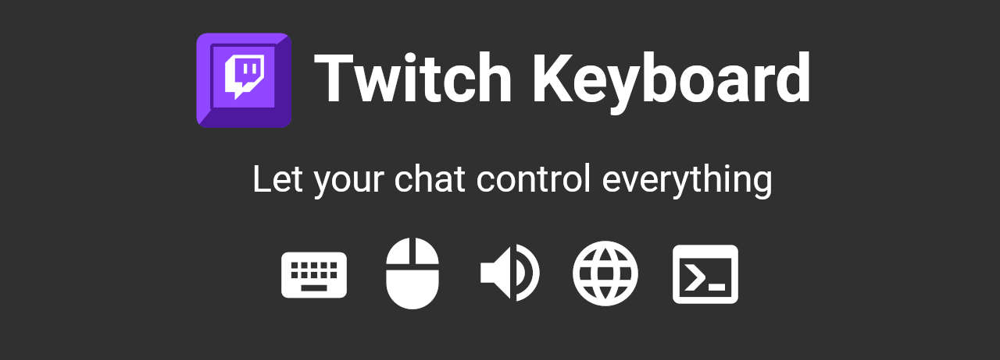
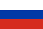
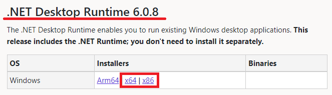
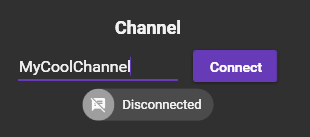
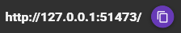
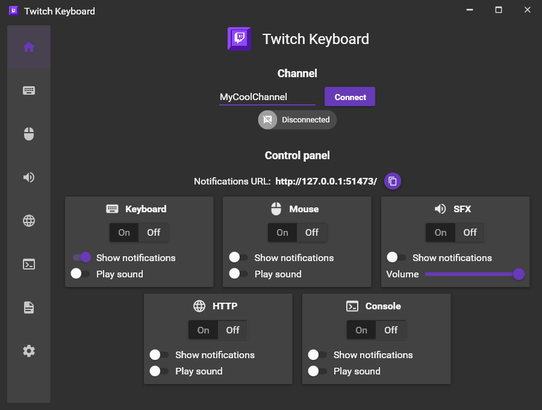
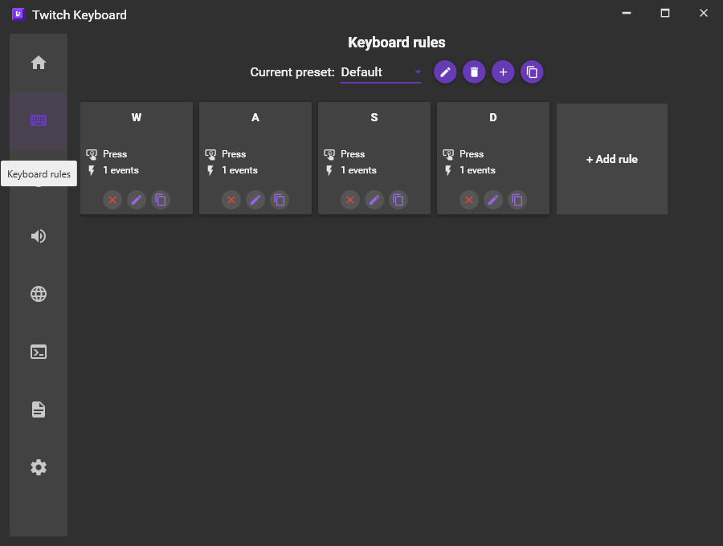
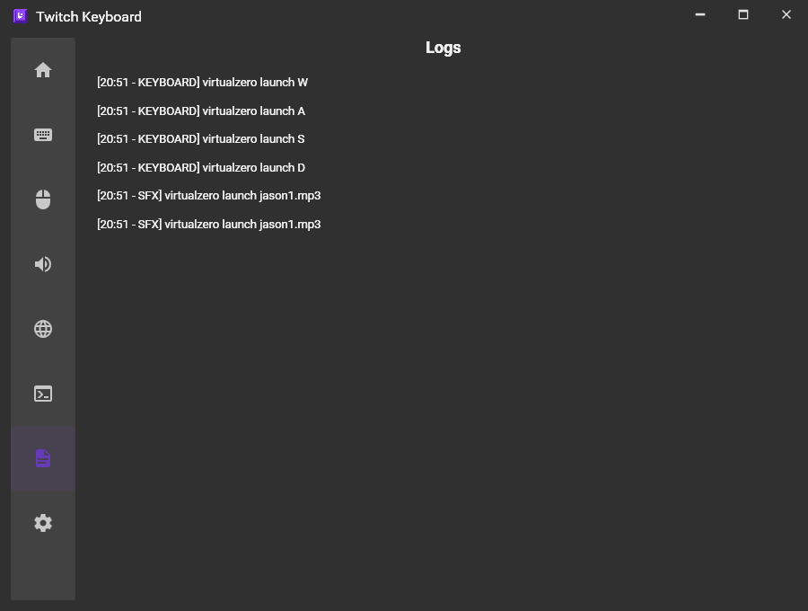
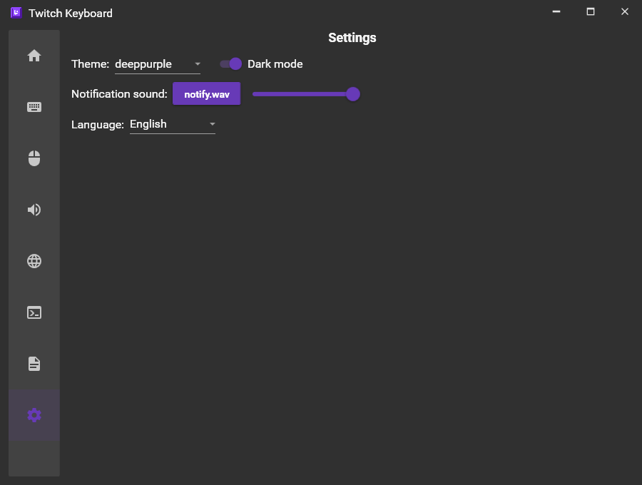

# Twitch Keyobard

  

### 

|  English version |  [Русская версия](https://github.com/VirtualZer0/TwitchKeyboard/blob/master/Docs/README.ru.md) |
| -------------------------------------------------: | ------------------------------------------------- |

## 👁‍🗨 About

**Twitch Keyboard** is an open-source Windows application that allows you to run certain scripts when you select events on Twitch chat.

**List of supported scenarios:**

- Keyboard control
- Mouse control
- Starting sound effects
- Starting HTTP requests
- Running console commands or selected files

**List of supported events:**

- Chat messages
- Using rewards
- Using Bits
- New subscription
- Resubscription
- Gift Subscription
- Raid

  

**Possible uses:**

- Controlling your game by viewers from the chat room
- Switching scenes in OBS using keyboard shortcuts
- Triggering sound effects when repeatedly repeating keywords in chat
- Running arbitrary scripts for your devices using HTTP or the command line

## 🕐 Quick Start

1. Download and install .NET 6 **Desktop Runtime** from [**this link**](https://dotnet.microsoft.com/download/dotnet/6.0). On recent versions of Windows the framework may be installed by default.

2. [**Download the latest version of the app**](https://github.com/VirtualZer0/TwitchKeyboard/releases)

3. Unzip the folder to a convenient location and run <u>TwitchKeyboard.exe</u>.

4. Enter the channel name and click the "Connect" button. This is the first thing you need to do if you want to get a list of your channel point rewards:

   

5. [Optional] Add a BrowserSource with app notifications to your scene in OBS. The URL for the notifications is on the main program window:

    

## 💬 Detailed instructions

❗ **The screenshots shown here may vary depending on the current version of Twitch Keyboard, but the basic instructions remain valid.**

### Main screen

The main screen of the application contains a channel connection panel and a scenario category control panel. Each category has the following elements:

- **Main switch** - controls enabling/disabling a specific category. When you start the application, all switches are in the Off position for security reasons. Don't forget to set them to On for your chosen category to work

- **Notification switch** - if on, the notifications will be displayed in your BrowserSource in OBS (if you have added it there before, by specifying the link from "Notification URL")

- **Sound switch** - if enabled, the notification sound will play when you activate an event from a category. You can adjust the sound and its volume in the "Settings" tab.

- SFX category also contains **volume slider**. This slider is responsible for the overall volume of all SFX. You can set up a separate volume for each SFX in "SFX rules" tab.

  

### Rules list screens

All rule screens contain the following elements:

- **Preset list** - allows you to create different presets for different use cases (for example, a different set of keys for each game). To change a preset, select it from the list. Only one selected preset for each category of rules can be active at a time. To the right of the list of presets are buttons, with which you can rename a preset, delete a preset, create a new one, or copy the selected one.
- **Rule list** - shows all the rules that are in the current preset. Each rule contains brief information about itself and buttons to delete, edit or duplicate this rule.
- **Add rule button** - opens the editor screen with settings for adding a new rule.

### Rules editing screens

The rule screens contain different settings depending on the selected rule category, but they all have common elements:

- **Event list** - contains triggers with conditions for activating this rule.

  For example, if you want users to be able to activate keystrokes for Bits, select "Bits" in the upper line of the settings and specify the range of amount that is required for activation.

  You can also make it so that more than one person's action is required to activate a rule. For example, if you want the phrase "Hello!" to play the SFX of your choice after 3 times in the last five minutes, check "If repeated", specify the number of times to repeat and the number of seconds in which those repetitions will be counted after the first such message.

  The last line is for text settings in the specified event. You can select exact matches with the text or search for specific words in the text (this option will work for you if you want the sound to be active for the words "<u>hello</u>, chat" and "<u>hello</u>, streamer" that contain the word "hello"). You can also leave this field empty, and the trigger will be triggered for the event you specify no matter what text it contains (for example, for each chat message or reward usage)

  You can have as many triggers as you want in one rule. This is useful when, for example, you want to activate a rule for both Bits and channel rewards.

  Each trigger also contains a button to delete or duplicate it.

- **Cooldown** - allows you to specify the time interval between two rule activations. As long as the specified time has not passed since the activation of the current rule, the reactivation of this rule will not happen again.

- **Delay** - specifies the delay before rule activation. This can be useful if you have multiple rules with the same conditions that you want to activate in a certain order.

  Also note the editing screen for keyboard rules: the "Keys" item contains a list of keys that must be pressed **at the same time** when activating that rule. This can be used for keyboard shortcuts, but it won't allow you to activate any one key from that list. To do that, you need to create a **separate rule with only one key**.

### Log screen

The log screen contains a list of the last 100 activated rules, the time, and the name of the user who activated those rules.

### Settings screen

The settings screen contains the basic settings of the program, such as the design theme, sound and notification volume, and language setting. The list of settings may vary depending on the version.

## ❔ FAQ

- **Keyboard or mouse button presses don't work in a particular game/program, but they work in other places, what can it be about?**

  Most games do not respond to a "Click" or "Push" event. Instead, use the "Hold" event with a small delay. In addition, this game or program may have been run as an administrator. For keyboard and mouse controls to work under these conditions, Twitch Keyobard also needs to be run as an administrator. 
- **Is it possible to change the style and annotation of the notifications for BrowserSource?**

  Yes, you can do this by editing the HTML/CSS/JS files in the Notifcations folder next to the program.
- **Is there a MacOS/Linux/etc version planned?**

  It depends on whether the WPF technology on which this application is written will be available for other operating systems. At this point, the likelihood of this happening is slim.

## 💥 Errors and suggestions

You can send information about a bug or your suggestion here:
[https://github.com/VirtualZer0/TwitchKeyobard/issues/new/choose](https://github.com/VirtualZer0/TwitchKeyboard/issues/new/choose)

If the application crashes, you should see a file **crashlog.txt** in its folder. Attach it to your bug report.
